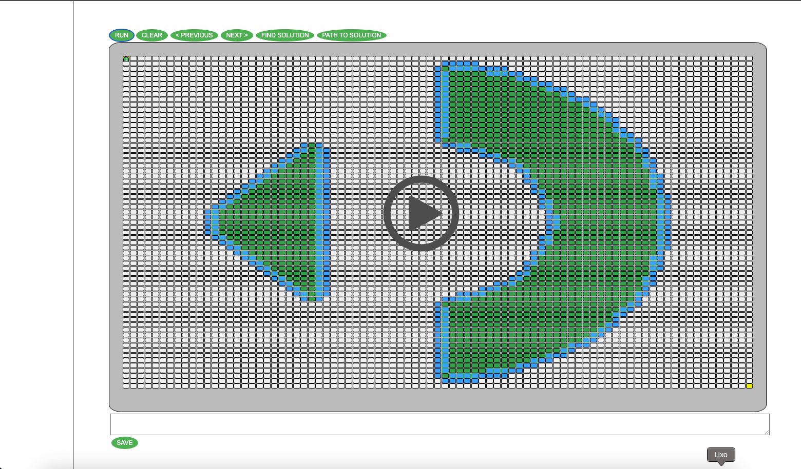

# walk-through-live-maze

You will have to walk through an automaton whose matrix has 65 rows and 85 columns, as shown in the picture below.

Since it would be practically impossible to solve by hand, you must attack this problem using algorithms and programming code. 

For this phase, the propagation model is as follows:

White cells turn green if they have a number of adjacent green cells greater than 1 and less than 5. Otherwise, they remain white.

Green cells remain green if they have a number of green adjacent cells greater than 3 and less than 6. Otherwise they become white.

Two cells are considered adjacent if they have a border, either on the side, above, below or diagonally. In the example below, the white cell in the center therefore has 8 adjacent white cells.

The initial configuration of the matrix, i.e. the color of each cell at the beginning, is represented in a file that you should download, which has the following characteristics:

A text file encoded in UTF-8 format. 

The text file contains 65 lines. Each line contains 85 integer values separated by a blank space followed by a newline character "\n". 

These values represent the states of the cells in a matrix with 65 rows and 85 columns. 

The value "3" represents the starting point, the value "4" represents the destination point. The value "0" represents a white cell and the value "1" a green cell.

 Each row in the file represents a row of the matrix and each row value the value of a cell in that row. The first value in the file represents the upper left corner of the matrix.

[Initial Matrix](https://s3.amazonaws.com/appforest_uf/f1678907491882x777874554533324300/input.txt)

Now that you have the initial configuration of the matrix, the task of finding a way through this maze is in your hands and you must submit your answer according to the instructions below.

SOLUTION SUBMISSION

You must submit a single line text file containing all the movements of the particle from the starting point to the destination point. 

Each movement must be separated by a blank space. Each letter represents a move of the particle, and consequently an update of the board.

U - movement up
D - movement down
R - movement to the right
L - movement to the left

The particle begins its move in the current state and ends its move after the board update. The particle must never finish its move in a green cell.

Example of a hypothetical answer with 10 moves: R R D R D L U D R R

# THIS SOLUTION
## How to use it

Running the index.html file, click RUN to make the initial setup.
You can move each evolution step (PREVIOUS and NEXT).

Green cells are dead cells.
Blue cells are cells that will be dead next evolution.
Blue cells and green border are both.

The purple circles are the nodes finding the solutions.

Also you can find the solution clicking on FIND.

After finding the solution, you can run the PATH, so it will display at the bottom of the page (text area) the moves.
You can click SAVE to save the file.

### TODO:
- Know issue with FIND PATH after using NEXT and PREVIOUS.
- Refactor and improve code.